# VDI Terraform — as-built design

**Audience:** engineers new to this monorepo.  
**Status:** Reflects code on `main` after legacy-to-TF parity (C01-C20 + Wave D + labCorePriv). **Hub03** = spare CIDR + `hub-spare` module in code — **not deployed** until uncommented.  
**Environments in scope:** `int` (DT / dev test), `prd` (production), and sandbox `igmf` (not bank cutover).  
**Region:** `uksouth` is live. Pipeline `location` also accepts `italynorth` / `spaincentral` (selectable; AzDo SC/backend + hub CIDRs still placeholders — not deploy-ready).

This is the practical LLD for **what Terraform actually deploys today**. Companion notes:

| Doc | Role |
|---|---|
| [docs/address-plan-hubs.md](docs/address-plan-hubs.md) | Hub CIDR decisions / rejects |
| [docs/variable-set.md](docs/variable-set.md) | Tags / DNS / identity checklist |
| [docs/subscription-inventory.md](docs/subscription-inventory.md) | SPNs, app IDs, known gallery GUIDs — may still say TF env `prod`; live folder is **`prd`** |
| [docs/lld-terraform-summary.md](docs/lld-terraform-summary.md) | LLD extract (some wording predates default-to-firewall / `prd` rename) |
| [docs/legacy-live-inventory.md](docs/legacy-live-inventory.md) · [docs/legacy-dead-code.md](docs/legacy-dead-code.md) · [docs/legacy-pipeline-fate.md](docs/legacy-pipeline-fate.md) | Phase 0 inventory |
| [docs/legacy-to-tda-rename-map.md](docs/legacy-to-tda-rename-map.md) · [docs/packer-tda-rename-checklist.md](docs/packer-tda-rename-checklist.md) | Naming / Packer rename helpers |
| [docs/plans/04-gap-analysis-legacy-vs-tf.md](docs/plans/04-gap-analysis-legacy-vs-tf.md) | Parity execution status (complete) |
| [docs/plans/02-azure-1.0-to-terraform-migration.md](docs/plans/02-azure-1.0-to-terraform-migration.md) | Migration context |
| [pipelines/README.md](pipelines/README.md) | Location / state keys / regional var-files |
| [environments/region/README.md](environments/region/README.md) | Per-region value files |

Local-only (gitignored — stay on disk, not pushed): `docs/plans/03-cursor-handoff.md`, `docs/plans/05-sandbox-deploy-runthrough.md`.

**IGMF sandbox** (`environments/igmf/{connectivity,mgmt,labs,avd}` via the **named** pipelines with `envName=igmf`): disconnected ignitemyfire.co.uk smoke tests — **not** bank cutover. Bank live targets remain `int` / `prd`.

**Hard rule:** session-host VMs are **not** Terraform. Terraform builds network, platform services, storage, and AVD *objects*. PowerShell / AzDo places VMs and users.

## Table of contents

- [Purpose and topology](#purpose-and-topology)
- [How the repo fits together](#how-the-repo-fits-together)
- [Pipeline → stack map](#pipeline--stack-map)
- [Deploy: Virtual WAN (vwan)](#deploy-virtual-wan-vwan)
- [Deploy: Connectivity](#deploy-connectivity)
- [Deploy: Management](#deploy-management)
- [Deploy: Labs](#deploy-labs)
- [Deploy: AVD](#deploy-avd)
- [Local tooling (scripts / functions)](#local-tooling-scripts--functions)
- [Module catalogue](#module-catalogue)
- [Identity, SPNs, and who does what](#identity-spns-and-who-does-what)
- [Naming and tags](#naming-and-tags)
- [Provider and state](#provider-and-state)
- [Network detail - CIDRs, routes, NSGs](#network-detail---cidrs-routes-nsgs)
- [Azure Virtual Desktop objects](#azure-virtual-desktop-objects)
- [Observability and alerts](#observability-and-alerts)
- [Labs storage and Key Vaults](#labs-storage-and-key-vaults)
- [Wiring map (outputs to inputs)](#wiring-map-outputs-to-inputs)
- [Deploy checklist](#deploy-checklist)
- [One-page cheat sheet](#one-page-cheat-sheet)
- [Module outputs quick-ref](#module-outputs-quick-ref)

---

## Purpose and topology

### What this programme is doing

Port the legacy Azure 1.0 VDI estate (Bicep + PowerShell across platform / pers / mult / scripts / images) onto Terraform for an **Azure Virtual WAN** design:

| Path | Hub | Traffic model |
|---|---|---|
| **Personal (PERS)** + **Privileged (PRIV)** + **mgmt** | **Hub01 (secured)** | Azure Firewall + Routing Intent (Internet + Private → firewall). ExpressRoute gateway on Hub01. |
| **Multisession (MSH)** | **Hub01 + Hub02** | Explicit UDR: internet `0.0.0.0/0` → Hub02 VPN (Palo Alto Proxy path); RFC1918 + `AzureCloud` → Hub01 firewall IP. Hub connections have `internet_security_enabled = false` so Routing Intent does not override the UDR. |
| **Nothing (not applied)** | **Hub03 (spare)** | Reserved CIDR + `hub-spare` module kept in code; `module "hub_spare"` **commented out** in `prd/connectivity`. No Azure resource until uncommented. Region-agnostic when enabled. Full Hub03 detail: [Deploy: Connectivity](#deploy-connectivity). |

### City metaphor (one glance)

| City part | In this estate |
|---|---|
| Motorway interchange | Virtual WAN + Hub01 + Hub02 (Hub03 spare = config only, not deployed) |
| Neighbourhoods | Spokes (mgmt / PERS / PRIV / MSH VNets) |
| Streets | Subnets (AgentsSubnet, AVDSubnet, AVDSubnet-00x) |
| Estate office rules | AVD host pools, workspaces, scaling plans |
| Photo library of house designs | Compute Gallery + image **definitions** |
| Actual houses / people | Session-host VMs — **PowerShell**, not Terraform |

### Architecture — platform overview

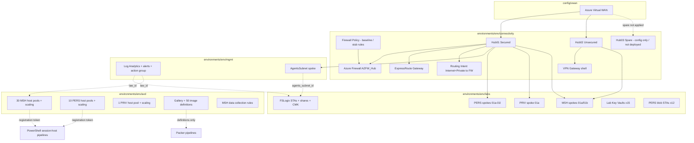

### Architecture — Hub01 (PERS / PRIV / mgmt) traffic

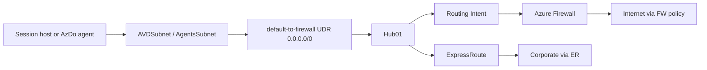

Hub connection: `internet_security_enabled = true`.  
Routing Intent already steers Internet + Private to the firewall; the spoke UDR matches legacy `default-to-firewall` for parity.

### Architecture — Hub02 / dual-hub (MSH) traffic

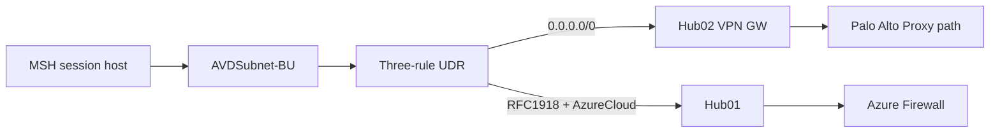

Hub connections to Hub01 **and** Hub02 use `internet_security_enabled = false` so Hub01 Routing Intent does not override the UDR.  
Hub02 VPN **site/peer is not wired yet** — gateway shell only. The `0.0.0.0/0` → `VirtualNetworkGateway` next hop is **PENDING senior review** under vWAN.

### Architecture — who builds what (TF vs PowerShell)

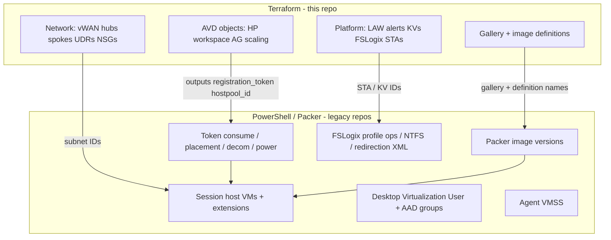

### Apply order (mandatory)

```text
1. config/vwan
2. environments/<env>/connectivity   (+ region/<location>/<env>.connectivity.tfvars)
3. environments/<env>/mgmt
4. environments/<env>/labs
5. environments/<env>/avd
```

`<env>` = `int` | `prd` | `igmf`.  
Stacks do **not** use remote-state data sources today. Wire outputs into the next stack’s values (region tfvars or pipeline vars) by hand.

---

## How the repo fits together

Three layers — do not confuse them:

| Layer | Path | Role |
|---|---|---|
| **Modules** | `modules/**` | Reusable logic (resources). Never queued by AzDo directly. |
| **Roots / workspaces** | `config/vwan`, `environments/<env>/<stack>` | Thin Terraform roots AzDo `cd`s into — call modules. |
| **Regional values** | `environments/region/<location>/<env>.<stack>.tfvars` | Subscription IDs, hub CIDRs, tags, DNS, etc. Loaded with `-var-file`. |

### What each workspace deploys

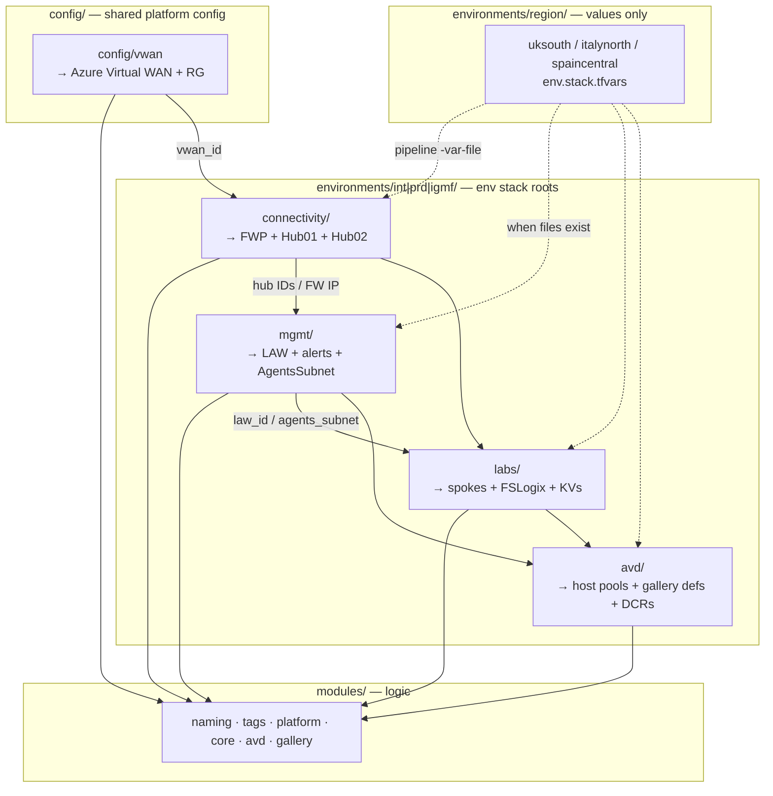

### Repo layout

```text
config/
  vwan/                              # Shared Virtual WAN root (not an env)
environments/
  int|prd|igmf/
    {connectivity,mgmt,labs,avd}/    # Stack roots (main.tf → modules)
  region/
    uksouth|italynorth|spaincentral/
      <env>.<stack>.tfvars           # Per region × env × stack values
                                     # connectivity files exist for all 3×3 today
modules/                             # Reusable bricks
pipelines/                           # Named AzDo entry points + templates
scripts/                             # Local module scaffold only (not AzDo)
legacy/                              # Local Azure 1.0 clones (gitignored)
```

Ignore for cutover: leftover `environments/<env>/{italynorth,spaincentral}/` README stubs (unused — pipelines use stack roots + region tfvars). Live env segment is **`prd`**, not `prod`.

---

## Pipeline → stack map

**Day-to-day entry points** (queue these):

| Pipeline | Stack | Working directory | Deploys |
|---|---|---|---|
| [`tf-vWAN-Deployment.yml`](pipelines/tf-vWAN-Deployment.yml) | `vwan` | `config/vwan` | Virtual WAN |
| [`tf-Hub-Deployment.yml`](pipelines/tf-Hub-Deployment.yml) | connectivity | `environments/<env>/connectivity` | FWP + Hub01 / Hub02 |
| [`tf-Hub-Management-Deployment.yml`](pipelines/tf-Hub-Management-Deployment.yml) | mgmt | `environments/<env>/mgmt` | LAW, alerts, AgentsSubnet |
| [`tf-AVD-Labs-Deployment.yml`](pipelines/tf-AVD-Labs-Deployment.yml) | labs | `environments/<env>/labs` | spokes, FSLogix, KVs, blobs |
| [`tf-AVD-Hostpool-Deployment.yml`](pipelines/tf-AVD-Hostpool-Deployment.yml) | avd | `environments/<env>/avd` | pools, gallery defs, DCRs |

Parameters on every named pipeline: `envName` (`int`\|`prd`\|`igmf`), `location` (`uksouth`\|`italynorth`\|`spaincentral`), `action` (`plan`\|`apply`\|`destroy`). Hub also takes `hubSelection`.

Catch-alls (`tf-release.yml`, `tf-igmf-*`, `tf-int-connectivity.yml`) are optional alternatives — **not** required for the flow above.

### Named pipeline → workspace → Azure

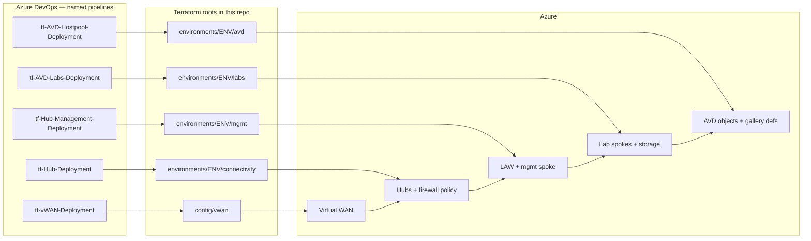

### How `location` + region tfvars work

1. You pick **`location`** on the pipeline (e.g. `uksouth`).
2. AzDo resolves **identity** via [`env-context.yml`](pipelines/templates/env-context.yml) (SC + agent + backend VG for uksouth igmf).
3. [`terraform-stack.yml`](pipelines/templates/terraform-stack.yml) sets:
   - **workdir** = `config/vwan` or `environments/<env>/<stack>` (same for all locations)
   - **state key** = `{env}/{stack}.tfstate` (uksouth) or `{env}/{location}/{stack}.tfstate` (other)
   - **`-var-file`** = `environments/region/<location>/<env>.<stack>.tfvars` **if that file exists**
   - **`-var=location=<location>`** always (overrides location in the file if both set)
4. Connectivity also passes `enable_hub01` / `enable_hub02` from `hubSelection`.

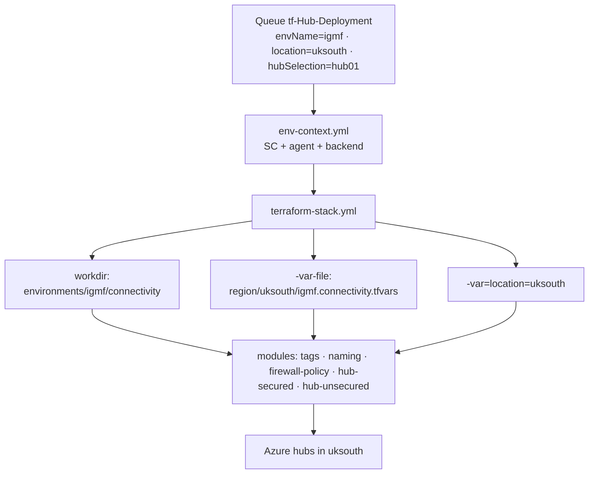

**Connectivity packages today:** all three locations × `int` / `prd` / `igmf` have `*.connectivity.tfvars`.  
- **uksouth** — filled (IGMF deploy-ready; int/prd still need real subscription / vWAN IDs).  
- **italynorth / spaincentral** — tags + placeholders; hub CIDRs blank (`""`) until address plan — do not apply yet.  
- **mgmt / labs / avd / vwan** — no region tfvars yet (IGMF uksouth can still seed from stack `*.tfvars.example`).

See [`environments/region/README.md`](environments/region/README.md).

### How a release run works

1. Queue a **named** pipeline, e.g. `tf-Hub-Deployment.yml` with `envName=igmf`, `location=uksouth`, `hubSelection=hub01`, `action=plan`.
2. `env-context.yml` picks SC / agent:
   - uksouth int → `SC-R-VDI-INT-C-01` / `uks-int-vdi-mgmt-vss-01`
   - uksouth prd → `SC-P-VDI-PRD-C-01` / `uks-prd-vdi-mgmt-vss-01`
   - uksouth igmf → `SC-IGMF-VDI-TF-01` / hosted + `tf-backend-igmf`
   - other locations → `TODO-<env>-<location>-SC` / hosted (placeholder)
3. Scope banner prints env, location, stack, state key, workdir, and whether a region var-file was found.
4. Job runs in the stack workdir; plan/destroy attach the region `-var-file` when present.
5. Apply order across separate runs: **vWAN → Hub → Management → Labs → Hostpool**.

### Split of responsibility (memorise this)

| Lane | Tooling | What it does |
|---|---|---|
| **INFRA** | This repo + named AzDo TF pipelines | Create/update platform + AVD *service objects* |
| **OPERATIONAL** | Legacy `vdi-scripts` / `vdi-mult` / `vdi-libraries` AzDo pipelines | Build/decom/power VMs, tokens, user RBAC, FSLogix profile ops |
| **IMAGES** | Legacy `vdi-images` Packer pipelines | Publish gallery **versions** into TF-managed definitions |
| **POLICY** | `vdi-initiatives` | Azure Policy — **deferred** (includes long-term Secure Hub FW rules) |

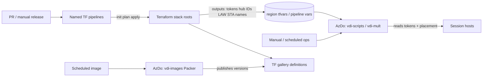

### Legacy repos — fate of each

| Legacy repo | What moved to Terraform | What **stays** PowerShell / Packer |
|---|---|---|
| `platform/vdi-platform` | Hub→vWAN, mgmt, LAW, alerts, AVD KV/RGs | Agent VMSS; PAC / full FW rules deferred |
| `pers/vdi-core-pers` | Lab spokes (PERS/PRIV/MSH networking) | Nothing for networking; VMs never lived here as primary |
| `mult/vdi-mult` | MSH host pools, scaling, FSLogix **storage**, DCRs | Session-host release/rotation/decom/DR; FSLogix **profile** ops; user assign |
| `scripts/vdi-scripts` | PERS/PRIV host pool + personal scaling **create** path | All VM build/decom/power/token/RBAC/packaging/disk/ADE |
| `images/vdi-images` | Gallery + image **definitions** + gallery RBAC shell | Packer **versions**, purge/reconcile/tag/copy |
| `libraries/vdi-libraries` | LAW overlap folded into mgmt | Device/session/group helpers — stays PS |
| `initiatives/vdi-initiatives` | — | **Deferred** (Azure Policy / Secure Hub rules) |

### Operational pipelines you will still run (unchanged logic)

These keep running in AzDo against the Azure objects Terraform created. They need **TDA/new names** where resources were renamed; the *logic* stays PS.

| Area | Typical legacy entry points | Needs from Terraform |
|---|---|---|
| PERS / PRIV VM build | `New-VDIAVD*` / `VDI-Pers.bicep` paths in `vdi-scripts` | Subnet IDs, registration token, host pool name, image definition |
| MSH session hosts | `vdi-mult` session-host release pipelines | Same + FSLogix STA/share names |
| Token lifecycle | `Start-TokenRenewal`, placement helpers | Live token from TF output / Azure (TF rotates via `time_rotating`) |
| User access | Update host-pool AAD membership / Desktop Virtualization User | App group IDs/names |
| FSLogix profiles | Profile delete/housekeep/redirection XML | STA + share names; SMB RBAC still PS |
| Images | Packer `*.pkr.hcl` in `vdi-images` | Gallery name + definition names |
| Agents | Mgmt VMSS pipelines | AgentsSubnet exists (TF); scale set itself PS |
| Decom / power / disk / ADE / DR | Various `vdi-scripts` / `vdi-mult` | Host/VM resource IDs in Azure |

### What got **retired** vs **deferred**

| Fate | Examples |
|---|---|
| **Retired** | Classic VNet peering deploy (replaced by `virtual_hub_connection`); `ppd` env; `*/retired/*` pipelines |
| **Replaced by TF** | Bicep deploy of hubs/mgmt/LAW/alerts/lab spokes/FSLogix STAs/MSH+PERS HP/SP/gallery definitions |
| **Deferred** | Full Firewall Policy allow-lists → Azure Policy; Hub02 VPN peer wiring; GLB library rewrite; subscription create/destroy |

### End-to-end day-in-the-life

1. Infra change (new CIDR, new alert, pool setting) → PR to this GitHub repo → named TF pipeline (or `tf-release.yml`) plan/apply on the right stack → state updates.
2. **Colleague desktop request** → existing PERS ops pipeline → reads placement + **registration token** from the TF-managed host pool → builds VM into PERS/PRIV subnet → joins pool.
3. **MSH capacity** → mult session-host pipeline → same pattern against MSH pools; FSLogix profiles land on TF-managed STAs.
4. **New image version** → Packer pipeline publishes into TF-managed definition → next VM builds pick `latest` or pinned version.
5. **Monitoring** → TF-managed LAW/alerts fire to Devices Lab action group (enabled in **prd**).

---

## Deploy: Virtual WAN (vwan)

| Field | Value |
|---|---|
| **Pipeline** | [`tf-vWAN-Deployment.yml`](pipelines/tf-vWAN-Deployment.yml) |
| **Working directory** | [`config/vwan`](config/vwan) |
| **State key** | `{env}/vwan.tfstate` (uksouth) or `{env}/{location}/vwan.tfstate` |
| **Region tfvars** | None yet — IGMF uksouth seeds from [`environments/igmf/global.tfvars.example`](environments/igmf/global.tfvars.example) |
| **Depends on** | Nothing (first apply) |
| **Feeds** | connectivity `virtual_wan_id` |
| **Out of this pipeline** | Hubs, firewall, spokes, AVD — all later stacks |

### What it creates

| Resource | Notes |
|---|---|
| Resource group | Naming segment `conn` |
| Virtual WAN | SKU Standard |

**Output → next:** `vwan_id` → paste into `environments/region/<location>/<env>.connectivity.tfvars` as `virtual_wan_id`.

Modules called: `naming`, `tags`, [`platform/vwan`](modules/platform/vwan).

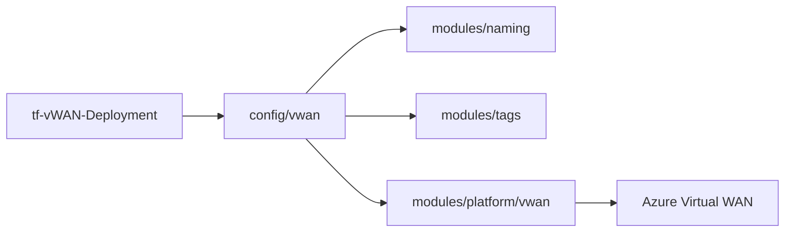

---

## Deploy: Connectivity

| Field | Value |
|---|---|
| **Pipeline** | [`tf-Hub-Deployment.yml`](pipelines/tf-Hub-Deployment.yml) (`hubSelection`: `hub01` \| `hub02` \| `both`) |
| **Working directory** | `environments/<env>/connectivity` |
| **Region values** | `environments/region/<location>/<env>.connectivity.tfvars` |
| **State key** | `{env}/connectivity.tfstate` (uksouth) or `{env}/{location}/connectivity.tfstate` |
| **Depends on** | `vwan` → `virtual_wan_id` in the region tfvars |
| **Feeds** | mgmt + labs (`hub01_id`, `hub01_firewall_private_ip`); labs MSH also needs `hub02_id` |
| **Out of this pipeline** | LAW/alerts, lab spokes/storage, AVD objects; Hub02 VPN **site/peer**; full FWP allow-lists; Hub03 until uncommented |

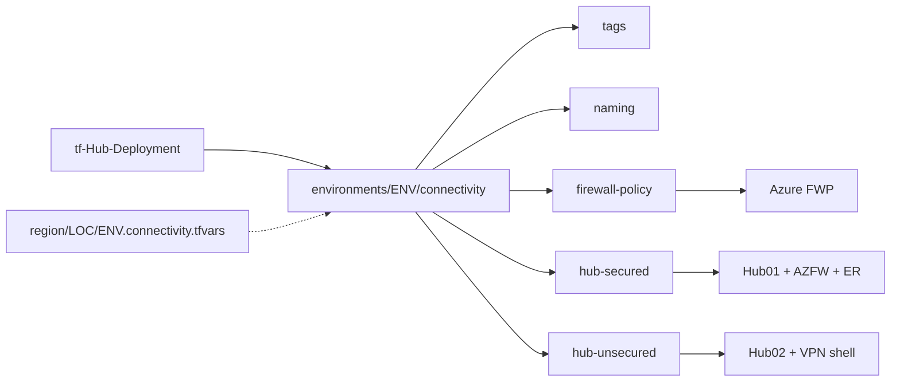

### What it creates

| Resource | Notes |
|---|---|
| Firewall policy | SKU Standard; DNS proxy **on**; servers = corporate DNS; **rule collections empty** (full Secure Hub rules → Azure Policy / later work) |
| Hub01 (`hub-secured`) | Virtual hub + **AZFW_Hub** + ExpressRoute gateway (`scale_units = 1`) + **Routing Intent**: InternetTraffic + PrivateTraffic → firewall |
| Hub02 (`hub-unsecured`) | Virtual hub + VPN gateway shell (`scale_unit = 1`, routing preference Microsoft Network). **No VPN site / connection yet** |
| Hub03 (`hub-spare`) | **Not in apply** — CIDR var retained; `module "hub_spare"` commented out. Uncomment to deploy (region-agnostic). |
| ER circuit connection | Only if `expressroute_circuit_peering_id` set (default `null`) |

**Hub address prefixes** come from the **region tfvars** (not hardcoded in `main.tf`):

| Env | Region file (uksouth) | Hub01 | Hub02 | Hub03 |
|---|---|---|---|---|
| int | [`region/uksouth/int.connectivity.tfvars`](environments/region/uksouth/int.connectivity.tfvars) | `10.170.245.0/24` | `10.170.246.0/24` | — |
| prd | [`region/uksouth/prd.connectivity.tfvars`](environments/region/uksouth/prd.connectivity.tfvars) | `10.218.64.0/22` | `10.218.68.0/22` | `10.218.72.0/22` (reserved) |
| igmf | [`region/uksouth/igmf.connectivity.tfvars`](environments/region/uksouth/igmf.connectivity.tfvars) | same as int (isolated tenant) | same | — |

Italy/Spain connectivity tfvars exist with the same tag standard; **hub CIDRs are blank** until the regional address plan is filled — do not apply those locations yet.

prd parent **`10.218.64.0/20`** holds three `/22` slices; only Hub01/02 are applied. See Hub03 below and [`docs/address-plan-hubs.md`](docs/address-plan-hubs.md).

**Terraform wiring:** `module.hub_secured` → Hub01, `module.hub_unsecured` → Hub02. `module.hub_spare` is commented — not in state. Only Hub01/02 IDs flow into `mgmt` and `labs`.

Do **not** use `10.170.248.0/24` as a hub prefix (collides with PERS `01l` `10.170.248.0/21`).  
prd hubs must stay distinct from int hubs on the shared `vwan` vWAN.

**Outputs → next:** `hub01_id`, `hub01_firewall_private_ip`, `hub02_id`, `firewall_policy_id`.  
`hub03_id` — N/A until `hub_spare` uncommented.  
Firewall private IP under vWAN is **not** classic `.4` — always take the connectivity output.

Modules called: `naming`, `tags`, `firewall-policy`, `hub-secured`, `hub-unsecured` (`hub-spare` = commented spare; not in apply).

### Hub03 (spare) — config present, **not deployed**

Hub03 is a **spare blueprint**: reserved CIDR + reusable module, **not** created with Hub01/Hub02 until you uncomment it. Region-agnostic (module takes `location`). No live Azure resource today — IGMF / int / prd connectivity apply only Hub01 + Hub02.

#### What stays in code (not applied)

| Piece | Detail |
|---|---|
| Module package | [`modules/platform/hub-spare`](modules/platform/hub-spare) — keep; do not delete |
| Module call | **`module "hub_spare"` commented out** in [`environments/prd/connectivity/main.tf`](environments/prd/connectivity/main.tf) |
| Variable | `hub03_address_prefix` — default **`10.218.72.0/22`** (reserved / not deployed) |
| Output | `hub03_id` — **commented out** (cannot reference a non-existent module) |

#### What Hub03 would not have (when enabled)

- No Firewall Policy attachment, AZFW, Routing Intent, ER/VPN gateways, or spoke connections

Session hosts still use Hub01 (PERS/PRIV/mgmt) or Hub01+Hub02 (MSH) exactly as before.

#### Why the CIDR exists

Azure 2.0 production reserves a **parent `/20`** and slices three `/22` hubs. The third slice stays reserved in code so:

1. Addresses stay **unique** on the shared vWAN when Hub03 is later enabled.
2. A future region/gateway/spoke can attach without re-carving `10.218.64.0/20`.
3. When enabled, **private** traffic can still steer through **Hub01** AZFW (Routing Intent) — Hub03 would be mesh-only until spokes/gateways attach.

**Billing note:** an empty virtual hub incurs capacity charges **once deployed**. Comment-out avoids that until needed.

#### How to enable later

1. Uncomment `module "hub_spare"` in `prd/connectivity/main.tf` (or copy the pattern into another env/region root).
2. Uncomment `output "hub03_id"` in `outputs.tf`.
3. Plan/apply connectivity. Module is region-agnostic via `var.location`.

#### prd hub IP layout (Azure 2.0)

Full detail: [`docs/address-plan-hubs.md`](docs/address-plan-hubs.md).

```text
10.218.64.0/20   prd hub parent (10.218.64.0 – 10.218.75.255)
├── 10.218.64.0/22   Hub01  secured   AZFW + Routing Intent + ExpressRoute  (deployed)
├── 10.218.68.0/22   Hub02  unsecured VPN gateway shell                     (deployed)
└── 10.218.72.0/22   Hub03  spare     reserved CIDR — not deployed until uncommented
```

| Slice | Usable host range (approx.) | Module | Deployed? |
|---|---|---|---|
| `10.218.64.0/22` | `10.218.64.0` – `10.218.67.255` | `hub-secured` | Yes |
| `10.218.68.0/22` | `10.218.68.0` – `10.218.71.255` | `hub-unsecured` | Yes |
| `10.218.72.0/22` | `10.218.72.0` – `10.218.75.255` | `hub-spare` | **No** (commented) |

**Do not use** `10.170.248.0/24` as any hub prefix — it collides with prd PERS spoke `01l` (`10.170.248.0/21`).

#### int hub IPs (unchanged — no Hub03)

| Hub | CIDR | Role |
|---|---|---|
| Hub01 | `10.170.245.0/24` | Secured |
| Hub02 | `10.170.246.0/24` | Unsecured |
| Hub03 | — | Not in int (and spare not applied on prd either) |

---

## Deploy: Management

| Field | Value |
|---|---|
| **Pipeline** | [`tf-Hub-Management-Deployment.yml`](pipelines/tf-Hub-Management-Deployment.yml) |
| **Working directory** | `environments/<env>/mgmt` |
| **State key** | `{env}/mgmt.tfstate` |
| **Depends on** | connectivity → `hub01_id`, `hub01_firewall_private_ip` |
| **Feeds** | labs (`agents_subnet_id`, optional `law_id` for file diags); avd (`law_id` for HP/SP diags + `dcr-msh`) |
| **Out of this pipeline** | Lab spokes/storage; AVD pools/gallery; Agent **VMSS** (PowerShell) |

### What it creates

| Resource | Notes |
|---|---|
| LAW | Retention **30** days. Resource-only permissions: int **true**, prd **false** |
| DCE + thin AVD Insights DCR | Full MSH DCR set lives in **avd** (`modules/platform/dcr-msh`) |
| Action group `devices_lab` | Short name `acg-devices`; email default `GRPG882932@nalloydsbanking.com` |
| Alert rules | Scheduled query + metric + activity log (see [Observability](#observability-and-alerts)). **Deployed** in both envs; **`enabled` only when `environment == "prd"`** |
| UAMI `custom-log-alerts-msi` | For ARG vCPU quota alerts; Reader on scoped lab/broker subs |
| APR suppression | Per scoped sub; `apr_enabled` default **false** |
| DevOps VM Contributor | See [Identity](#identity-spns-and-who-does-what) |
| Mgmt spoke | `spoke-pers` pattern; whole VNet = AgentsSubnet |

**Mgmt CIDRs:**

| Env | AgentsSubnet / VNet |
|---|---|
| int | `10.170.139.192/26` |
| prd | `10.170.241.64/26` |

Service endpoints on AgentsSubnet: `Microsoft.Storage`, `Microsoft.KeyVault`.  
NSG: deny east-west using AgentsSubnet CIDR (priority 4000).  
Route table: `default-to-firewall` → Hub01 firewall private IP when IP is passed.

**Outputs → next:** `law_id`, `agents_subnet_id`, `vnet_id`, `alert_action_group_ids`, `alert_uami_id` / `alert_uami_principal_id`.

Modules called: `naming`, `tags`, `management`, `spoke-pers` (+ alert/APR/UAMI resources in root).

---

## Deploy: Labs

| Field | Value |
|---|---|
| **Pipeline** | [`tf-AVD-Labs-Deployment.yml`](pipelines/tf-AVD-Labs-Deployment.yml) |
| **Working directory** | `environments/<env>/labs` |
| **State key** | `{env}/labs.tfstate` |
| **Depends on** | connectivity (`hub01_id`, `hub01_firewall_private_ip`, `hub02_id`); mgmt (`agents_subnet_id`; optional `law_id`) |
| **Feeds** | PowerShell placement (VNet/subnet IDs); FSLogix STA names for ops + mgmt alert share scopes; Packer/ops KV IDs |
| **Out of this pipeline** | Host pools, gallery, DCRs; session-host VMs; FSLogix **profile** ops |

### What it creates

| Resource | Notes |
|---|---|
| PERS spokes 01a-01l | Hub01; `default-to-firewall` UDR; AVDSubnet |
| PRIV spoke 01a | Same spoke pattern; **no local AZFW** (legacy had one; Hub01 is next hop). FW CIDR space reserved in VNet address space only. Toggle: empty `priv_spokes` / flags |
| MSH spokes 01a/01b | Dual-hub + three-rule UDR |
| 10 FSLogix STAs + shares | Per-BU placement; gated by `enable_fslogix` |
| FSLogix CMK | Per-STA UAMI (`{legacyStaName}-msi`) + RSA-4096 key `{sta}-sa-cmk` on that lab’s **Multi** KV; wired when `enable_lab_keyvaults` |
| 15 lab Key Vaults | 2 Multi + 12 PERS + 1 PRIV (when priv + flags on) |
| 12 PERS blob STAs | StorageV2 Standard_LRS; Deny ACL; **no CMK** |

DNS on all lab VNets: `10.19.96.1`, `10.19.97.1`.

**Outputs → next:** VNet ID maps, FSLogix STA names, lab KV IDs, PERS blob STA names, CMK identity IDs — see [Wiring map](#wiring-map-outputs-to-inputs). No file-share ID outputs (share names stay inside the FSLogix module; alert scopes are built in mgmt tfvars).

Modules called: `naming`, `tags`, `spoke-pers`, `spoke-msh`, `storage-fslogix`, `storage-blob`, `keyvault`.

---

## Deploy: AVD

| Field | Value |
|---|---|
| **Pipeline** | [`tf-AVD-Hostpool-Deployment.yml`](pipelines/tf-AVD-Hostpool-Deployment.yml) |
| **Working directory** | `environments/<env>/avd` |
| **State key** | `{env}/avd.tfstate` |
| **Depends on** | mgmt `law_id` (recommended for diags + `dcr-msh`); Packer MSI / WVD principal GUIDs in tfvars when enabling those RAs |
| **Feeds** | PowerShell session-host pipelines (registration tokens, host pool IDs); Packer (gallery + definition names) |
| **Out of this pipeline** | Session-host VMs; Packer **image versions**; DCR **associations** onto VMs; Desktop Virtualization User / AAD assign |

### What it creates

| Resource | Notes |
|---|---|
| MSH workspace + **30** host pools | Pooled; token rotation via `time` provider |
| MSH scaling | One **standard** plan + one **decom** sibling per pool (`scaling_plan_enabled = false` on decom) |
| PERS workspace + **10** host pools + personal scaling | Default **on** (`enable_pers_host_pools = true`); personal schedules via **azapi** |
| PRIV workspace + **1** host pool + personal scaling | Default **on** (`enable_priv_host_pools = true`); azapi schedules; **no stack outputs yet** for PRIV |
| AVD Key Vault | `keyvault_unique_id` default int `avdint1` / prd `avdprd1` |
| Gallery + **50** image definitions | Versions = Packer |
| MSH DCR/DCE/tables | When `law_id` set (`modules/platform/dcr-msh`) |
| WVD Power On Off RAs | When principal set |

**Outputs → next:** MSH `registration_tokens` / `hostpool_ids`; PERS `pers_registration_tokens` / `pers_hostpool_ids`; gallery + image definition names; `msh_dcr_ids`; `keyvault_id`.

Modules called: `naming`, `tags`, `hostpool`, `workspace`, `scalingplan`, `gallery`, `image-definition`, `keyvault`, `dcr-msh` (+ WVD role assignments in root).

Full pool / gallery catalogues: [Azure Virtual Desktop objects](#azure-virtual-desktop-objects).

---

## Local tooling (scripts / functions)

Local PowerShell only — **not** invoked by AzDo. Use these when scaffolding new reusable modules on a developer machine.

| Path | Role |
|---|---|
| [`scripts/New-TerraformModule.ps1`](scripts/New-TerraformModule.ps1) | Entry point: scaffold a module directory |
| [`scripts/functions/`](scripts/functions/) | Shared helpers loaded by the scaffold script (`Import-ScriptFunctions.ps1`, `New-TerraformModuleScaffold.ps1`, `Test-TerraformModuleParameter.ps1`) |

Creates `main.tf`, `variables.tf`, `outputs.tf`, `versions.tf`, `README.md` (with naming/tags integration examples), `examples/basic/`, and `tests/`. Fill in real resources, then wire from an `environments/<env>/...` stack.

**Not for cutover:** [`modules/core/demo-module`](modules/core/demo-module) and [`modules/core/scaffold-smoke`](modules/core/scaffold-smoke) — ignore for bank deploy.

### Usage examples

From the repo root:

```powershell
# New Azure resource module under modules/core
.\scripts\New-TerraformModule.ps1 `
  -name storage-blob `
  -path modules\core `
  -description "Blob storage account for PERS workloads"

# Another category
.\scripts\New-TerraformModule.ps1 -name my-brick -path modules\platform

# Overwrite an existing scaffold
.\scripts\New-TerraformModule.ps1 -name my-brick -path modules\platform -force
```

---

## Module catalogue

Every environment stack is thin glue: it calls these modules with env-specific maps (CIDRs, pool catalogs, flags). **Names always come from `modules/naming`. Tags always come from `modules/tags`.**

### Cross-cutting (no Azure resources)

| Module | What it does | Used by |
|---|---|---|
| [`modules/naming`](modules/naming) | Pure computation: turns resource type + region + subscription segment + description into a TDA-compliant name. Fails plan on unknown types. | Every module that creates a named Azure resource |
| [`modules/tags`](modules/tags) | Pure computation: merges mandatory bank tags + platform tags (`managed-by=terraform`, env, region, workload, repo) + optional extras | Every env root / module that tags resources |

### Platform — Virtual WAN and hubs

| Module | What it does | Used by |
|---|---|---|
| [`modules/platform/vwan`](modules/platform/vwan) | Creates the **Azure Virtual WAN** (Standard SKU). One shared backbone. | `config/vwan` |
| [`modules/platform/firewall-policy`](modules/platform/firewall-policy) | Creates **Firewall Policy** + optional IP groups + rule collection groups. Today: DNS proxy on, **rule collections stub/empty** (full Secure Hub rules → Azure Policy later). | `connectivity` → attached to Hub01 firewall |
| [`modules/platform/hub-secured`](modules/platform/hub-secured) | **Hub01**: virtual hub + AZFW_Hub + ExpressRoute gateway + Routing Intent (Internet + Private → firewall). Outputs `hub_id`, `firewall_private_ip`. | `connectivity` |
| [`modules/platform/hub-unsecured`](modules/platform/hub-unsecured) | **Hub02**: virtual hub + VPN gateway shell (no firewall, no Routing Intent). VPN site/connection not added yet. | `connectivity` |
| [`modules/platform/hub-spare`](modules/platform/hub-spare) | **Hub03** spare blueprint: bare virtual hub — no FW/VPN/ER/spokes. CIDR reserved; enable by uncommenting. | **none today** (commented in `prd/connectivity`) |

### Platform — observability

| Module | What it does | Used by |
|---|---|---|
| [`modules/platform/management`](modules/platform/management) | Shared **LAW** + optional DCE + thin AVD Insights DCR + action groups + metric / activity / scheduled-query alerts + workbooks. Alert maps reference action groups by key. | `mgmt` |
| [`modules/platform/dcr-msh`](modules/platform/dcr-msh) | Full **multisession** data collection: DCE + main/insights/FSLogix/WSS DCRs + custom tables `multfslp_CL` / `WSS_CL`. Does **not** associate rules to VMs. | `avd` (when `law_id` set) |

### Core — spokes and storage

| Module | What it does | Used by |
|---|---|---|
| [`modules/core/spoke-pers`](modules/core/spoke-pers) | **Personal-style spoke**: VNet, subnets, NSGs, Hub01 connection (`internet_security_enabled = true`), optional `default-to-firewall` RT. | PERS labs, PRIV lab, **mgmt AgentsSubnet** |
| [`modules/core/spoke-msh`](modules/core/spoke-msh) | **Multisession spoke**: VNet, subnets, NSGs, **three-rule UDR**, Hub01 + Hub02 connections (`internet_security_enabled = false`). Senior-review complexity. | MSH labs 01a/01b |
| [`modules/core/keyvault`](modules/core/keyvault) | Premium/RBAC Key Vault + optional keys/secrets + role assignments. | Lab KVs (multi/pers/priv); AVD-sub KV |
| [`modules/core/storage-fslogix`](modules/core/storage-fslogix) | Premium FileStorage (default) for FSLogix: SMB/AADKERB settings, shares, optional CMK, Deny ACL model. | labs — 10 STAs |
| [`modules/core/storage-blob`](modules/core/storage-blob) | StorageV2 blob account for PERS labs (Standard_LRS, shared key off, Deny ACL). | labs — 12 blob STAs |

### AVD and gallery

| Module | What it does | Used by |
|---|---|---|
| [`modules/avd/hostpool`](modules/avd/hostpool) | One host pool + **rotating registration token** (`time_rotating`). Optional `scheduled_agent_updates` window (MSH: Sat 01:00 GMT). Pooled or Personal. Sensitive token output for PS pipelines. | `avd` MSH / PERS / PRIV |
| [`modules/avd/workspace`](modules/avd/workspace) | Workspace + application groups + associations. | `avd` |
| [`modules/avd/scalingplan`](modules/avd/scalingplan) | Scaling plan + host-pool associations + optional LAW diagnostics. `exclusion_tag` (legacy `spExclude`). Pooled schedules via azurerm; **personal schedules via azapi** (provider gap). | `avd` (MSH standard+decom; PERS/PRIV personal) |
| [`modules/gallery/gallery`](modules/gallery/gallery) | One Compute Gallery + RBAC (Packer custom role). | `avd` |
| [`modules/gallery/image-definition`](modules/gallery/image-definition) | One image **definition** (metadata). Versions = Packer. | `avd` — 50× `for_each` |

### Which stack calls which modules

```text
vwan           → naming, tags, platform/vwan
connectivity   → naming, tags, firewall-policy, hub-secured, hub-unsecured
                 (hub-spare = commented spare; not in apply)
mgmt           → naming, tags, management, spoke-pers (+ alert/APR/UAMI resources in root)
labs           → naming, tags, spoke-pers, spoke-msh, storage-fslogix, storage-blob, keyvault
avd            → naming, tags, hostpool, workspace, scalingplan, gallery, image-definition,
                 keyvault, dcr-msh (+ WVD role assignments in root)
```

---

## Identity, SPNs, and who does what

### Azure DevOps service connections (deploy)

| Env | Deploy SPN (Contributor-style deploy) | User-assigned / UAA SPN |
|---|---|---|
| int (DT) | `SC-R-VDI-INT-C-01` | `SC-R-VDI-ALL-UAA-01` |
| prd | `SC-P-VDI-PRD-C-01` | `SC-P-VDI-ALL-UAA-01` |

Legacy app registration IDs (from platform config — useful for cross-checks):

| Env | App (client) ID | Object ID |
|---|---|---|
| int | `fc9d5727-3be0-4411-9493-e0a08652d946` | `8b14ddaa-bf5c-4f3f-bfdd-38df5329907d` |
| prd | `ddeac00d-897a-4fcc-b8e4-6155a009d22d` | `9efaa678-fe19-4045-bdb8-d4ad2042e0a4` |

Tenant IDs come from AzDo macros (`common_*_tenantId`) → pipeline / `ARM_TENANT_ID`, not hardcoded in modules.

### Private agents

| Name | Owner |
|---|---|
| `uks-{env}-vdi-mgmt-vss-01` | **PowerShell** (not TF). Lives on mgmt AgentsSubnet after TF creates the VNet. |

### Terraform-managed platform identities / RBAC

| Identity / assignment | Stack | Role | Scope | Default |
|---|---|---|---|---|
| DevOps ADA SP → Virtual Machine Contributor | mgmt | Virtual Machine Contributor | mgmt subscription | int `57f1c9ac-b33d-404a-8a06-a9cee526964a` (SP-R-VDI-ADA-VMC-01); prd `e40ed67b-b191-4562-b9b1-130f8d389d65` (SP-P-VDI-ADA-VMC-01) |
| `custom-log-alerts-msi` | mgmt | Reader | each GUID in `alert_mult_*` + `alert_pers_*` + `alert_broker_*` maps | created when `enable_alert_uami = true` |
| FSLogix per-STA UAMI `{sta}-msi` | labs | Key Vault Crypto Service Encryption User | Multi lab KV | with FSLogix + lab KVs |
| Gallery Packer build MSI | avd | **Custom role GUID** (not Contributor) | gallery RG | empty until tfvars; see [Wiring map](#wiring-map-outputs-to-inputs) |
| Windows Virtual Desktop first-party SP | avd | Desktop Virtualization Power On Off Contributor | AVD sub + optional mult lab subs | principal **null** until set; AppId `9cdead84-a844-4324-93f2-b2e6bb768d07` |

### Stays PowerShell (do not invent in TF)

Full pipeline ownership is under [Pipeline → stack map](#pipeline--stack-map). Short list:

- Session-host VMs (PERS / MSH / PRIV / Packaging)
- Consuming registration tokens / placement (`Get-PlacementAVD`, etc.)
- Desktop Virtualization User + AAD group membership on application groups
- Packer **image versions** (definitions are TF)
- Agent VMSS
- FSLogix profile create/delete / NTFS / redirection XML
- DCR **associations** onto VMs (DCR *resources* are TF)
- KV secret material / ADE key rotation into vaults

---

## Naming and tags

### `modules/naming` (TDA ARN v2)

| Pattern | Example shape |
|---|---|
| Default | `{region}-{subscription}-{abbr}-{description}-{unique}` → `uks-...` for uksouth |
| Resource group | `{region}-{subscription}-rsg-{description}` |
| Key Vault | `{region}-{environment}-...-kvt-{7char}` (<=24) |
| Storage | alnum concat <=24; FSLogix/blob often use **`name_override`** for legacy names |
| Gallery | underscore-joined |
| AVD abbreviations | `vdh` / `vdw` / `vda` / `vds` — **PENDING(TDA)** |

Hub connection names for spokes are intentional literals: `vhc-{spoke}-hub01` / `vhc-{spoke}-hub02`.

### `modules/tags`

Mandatory keys (every stack): `costCentre`, `securityClassification`, `resourceOwner`, `CMDB_AppID`.

Example values (platform):

| Key | Value |
|---|---|
| costCentre | `CLL411S1XJ` |
| securityClassification | `Limited` |
| resourceOwner | `Fletcher, Wayne (Colleague ID 0028929)` |
| CMDB_AppID | `AL17611` |

Platform tags always merged: `managed-by=terraform`, `environment`, `region`, `workload`, `repo=vdi-terraform`.  
Workloads used: `vdi-platform`, `vdi-pers`, `vdi-mult`, `vdi-priv`.

---

## Provider and state

Every live stack uses `azurerm >= 4.0.0, < 5.0.0` and Terraform `>= 1.5.0`. The **avd** stack also needs **`azapi`** (personal scaling schedules) and **`time`** (host-pool token rotation):

```hcl
terraform {
  required_version = ">= 1.5.0"
  required_providers {
    azurerm = { source = "hashicorp/azurerm", version = ">= 4.0.0, < 5.0.0" }
    azapi   = { source = "Azure/azapi",       version = ">= 2.0.0, < 3.0.0" } # avd only
    time    = { source = "hashicorp/time",    version = ">= 0.9.0" }          # hostpool (via avd)
  }
  backend "azurerm" {}   # partial — RG / SA / container / key at init
}

provider "azurerm" {
  features {}
  subscription_id = var.azure_subscription_id
}
# avd also declares: provider "azapi" {}
```

State keys match [`pipelines/templates/terraform-stack.yml`](pipelines/templates/terraform-stack.yml): **`{env}/{stack}.tfstate`**

| Stack | Example key (uksouth) | Example key (italynorth) |
|---|---|---|
| `vwan` | `int/vwan.tfstate` | `int/italynorth/vwan.tfstate` |
| connectivity | `int/connectivity.tfstate` | `int/italynorth/connectivity.tfstate` |
| mgmt / labs / avd | `{env}/mgmt.tfstate` etc. | `{env}/{location}/mgmt.tfstate` etc. |

Each stack’s `azure_subscription_id` is the **subscription that owns that stack’s resources**. Legacy estate is multi-subscription (hub / mgmt / avd / lab). Cutover preserves that: one provider context per root.

---

## Network detail - CIDRs, routes, NSGs

### Hub address prefixes (summary)

| Env | Hub01 (secured) | Hub02 (unsecured) | Hub03 (spare) |
|---|---|---|---|
| **int** | `10.170.245.0/24` | `10.170.246.0/24` | not in env |
| **prd** | `10.218.64.0/22` | `10.218.68.0/22` | `10.218.72.0/22` reserved — **not deployed** |

Under Virtual WAN, each hub CIDR is the virtual hub `address_prefix` — not a classic VNet with `AzureFirewallSubnet` / `GatewaySubnet` children. Firewall and ER/VPN attach as **hub SKUs** on Hub01/Hub02 only.

**Hub03 traffic:** none — no Azure resource until uncommented. When enabled later, mesh-only until spokes/gateways attach. Full enable steps: [Deploy: Connectivity](#deploy-connectivity).

### Corporate DNS (everywhere)

`10.19.96.1`, `10.19.97.1`

### Traffic paths

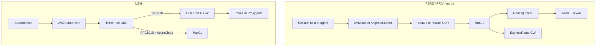

### PERS / PRIV / mgmt — Hub01 attachment

| Setting | Value |
|---|---|
| Module | `modules/core/spoke-pers` |
| Hub connection | Hub01 only; `internet_security_enabled = true` |
| Route table | When `hub01_firewall_private_ip` set: `0.0.0.0/0` → VirtualAppliance (FW IP), BGP propagation disabled |
| Note | Routing Intent also steers Internet/Private to FW; the UDR matches legacy `default-to-firewall` for parity |

### MSH — dual hub + three-rule UDR

| Route | Next hop |
|---|---|
| `0.0.0.0/0` | `VirtualNetworkGateway` (default) — intended Hub02 VPN toward Palo Alto. **PENDING senior review under vWAN** (may need VirtualAppliance to VPN GW private IP). |
| `10.0.0.0/8`, `172.16.0.0/12`, `192.168.0.0/16` | Hub01 firewall private IP |
| `AzureCloud` (service tag) | Hub01 firewall private IP |

Hub01 + Hub02 connections: `internet_security_enabled = false`.

### INT address plan (defaults in `variables.tf`)

| Spoke | Address space | Subnets |
|---|---|---|
| Mgmt | `10.170.139.192/26` | AgentsSubnet = same |
| PRIV 01a | `10.170.137.0/24` | AVDSubnet `10.170.137.0/25` (`.128/26` + `.192/26` reserved; not deployed as AzureFirewall* subnets) |
| PERS 01a | `10.170.140.0/28` | AVDSubnet = same |
| PERS 01b | `10.170.140.16/28` | AVDSubnet = same |
| PERS 01c-01l | `10.170.140.{32...176}/28` | step 16 |
| MSH 01a | `10.170.141.0/24` | 001 `10.170.141.0/27`, 002 `.32/27`, 003 `.64/27`, 004 `.96/27`, 008 `.128/27`, 009 `.160/27` |
| MSH 01b | `10.170.142.0/24` | 005 `10.170.142.0/25`, 006 `.128/27`, 007 `.160/27`, 999 `.192/27` |

### PRD address plan (defaults)

| Spoke | Address space | Notes |
|---|---|---|
| Mgmt | `10.170.241.64/26` | |
| PRIV 01a | `10.170.228.0/22` | AVDSubnet `10.170.228.0/23` |
| PERS 01a-01h | `10.170.160.0/21` ... `10.170.216.0/21` | VNet = AVDSubnet |
| PERS 01i | `10.170.224.0/22` | Robotics |
| PERS 01j | `10.170.241.0/27` | P&D (adjacent to mgmt) |
| PERS 01k | `10.170.232.0/21` | |
| PERS 01l | `10.170.248.0/21` | Do not reuse `248/24` for Hub02 |
| MSH 01a | `10.218.16.0/21` | 001-004 `/24`, 008 `/26` (`10.218.20.0/26`), 009 `/24` |
| MSH 01b | `10.218.24.0/21` | 005 `/22`, 006/007/999 `/24` |

### NSG custom rules (labs)

Azure default rules (65000+) stay platform-managed. Custom rules from legacy `params-netsec.json`:

| Spoke type | Pattern |
|---|---|
| PERS standard | Allow Delivery Optimization TCP/UDP 7680+3544 inbound within AVDSubnet; deny east-west pri 4000; deny TURN UDP 3478 outbound to `20.202.0.0/16` |
| PERS 01i | + RPA ports 8181-8183, 8199-8200; no TURN deny |
| PERS 01k / 01l | Thin: TCP DO only + deny east-west |
| PRIV | Same as PERS standard |
| MSH | Same four-rule shape but scope = **VNet address space** (names `*-inbound-vnet`), duplicated on every AVDSubnet NSG |

Mgmt AgentsSubnet: deny east-west by AgentsSubnet CIDR only (pri 4000).

### Service endpoints

On PERS / PRIV / MSH AVD subnets and mgmt AgentsSubnet: `Microsoft.Storage`, `Microsoft.KeyVault` (for Deny ACL + SE allow-list model; **no Private Endpoints** — legacy 1.0 never had them).

---

## Azure Virtual Desktop objects

### Multisession — 30 pools

Keys: BUs `001`-`009` + `999`, pools `00` / `01` / `02`.

| Property | Value |
|---|---|
| Type / load balancer | Pooled / BreadthFirst |
| Preferred app group | Desktop |
| `start_vm_on_connect` | **false** |
| Registration token | **175 hours** (~ legacy Bicep `PT175H10M`) |
| Agent updates | Enabled; **Saturday 01:00**; timezone `GMT Standard Time`; use session-host timezone **false** |
| Max sessions | **Per-pool 6 / 10 / 15 / 18** (catalog in `msh_scaling.tf`). Variable `default_max_session_limit = 16` is unused by the catalog. **Zero pools use 16.** |
| Validation environment | **true** on nine `*-00` canaries; **`005-00` is false** |
| Custom RDP | Per-pool MULT-* string from legacy `RDPProperties.json` |
| Scaling | One **standard** plan + one **decom** plan per pool; standard association enabled; decom association **disabled** |
| Exclusion tag | `spExclude` |
| Scaling diagnostics | `allLogs` → LAW when `law_id` set |
| Schedule catalog | Shared; `*-00` uses canary schedules; BU **005** uses `*_005` / `*_005_canary` |

**Max sessions by pool (both envs):**

| Pool | Max | Validate |
|---|---:|---|
| 001-00 | 6 | true |
| 001-01 | 10 | false |
| 001-02 | 6 | false |
| 002-00 | 6 | true |
| 002-01 | 6 | false |
| 002-02 | 6 | false |
| 003-00 | 6 | true |
| 003-01 | 18 | false |
| 003-02 | 15 | false |
| 004-00 | 6 | true |
| 004-01 | 6 | false |
| 004-02 | 6 | false |
| 005-00 | 6 | **false** |
| 005-01 | 18 | false |
| 005-02 | 15 | false |
| 006-00 | 6 | true |
| 006-01 | 18 | false |
| 006-02 | 6 | false |
| 007-00 | 6 | true |
| 007-01 | 15 | false |
| 007-02 | 6 | false |
| 008-00 | 6 | true |
| 008-01 | 15 | false |
| 008-02 | 15 | false |
| 009-00 | 6 | true |
| 009-01 | 18 | false |
| 009-02 | 18 | false |
| 999-00 | 6 | true |
| 999-01 | 15 | false |
| 999-02 | 15 | false |

**MSH workspace friendly names:** int `DevTest Shared Desktops` / prd `Shared Desktops`.  
**App group friendly names:** `{BU} ({bu}-{pool})` pattern.

### Personal — 10 pools (default on)

From `PERS-General` + `PERS-Packaging` (Robot out — RDP broker, not AVD).

| Pool | RDP persona |
|---|---|
| 001-01, 001-02, 001-03 | standard |
| 001-04 | copypaste |
| 001-05, 001-06 | smartcard |
| 002-01 | print-copypaste |
| 003-01, 003-02, 003-03 | copypaste |

| Property | Value |
|---|---|
| Type / LB / assignment | Personal / Persistent / **Direct** |
| Max sessions | **9999** |
| `start_vm_on_connect` | **true** |
| Token hours | **240** (PSM1 pipeline default) |
| Workspace friendly name | int `RTL-DESKTOPS` / prd `LIVE-DESKTOPS` |
| App group friendly name | `Desktop {pool}` |
| Personal scaling | Weekdays + weekend; StartVMOnConnect Enable all phases; deallocate after disconnect 90 / logoff 120; ramp-down 17:00; off-peak 20:00 |

Skip: `enable_pers_host_pools = false`. Override catalog via non-empty `pers_host_pools`.

### Privileged — 1 pool (default on)

| Pool | Persona | Workspace |
|---|---|---|
| 001-01 | copypaste | `PRIV-DESKTOPS` |

Same personal shape as PERS (Direct / 9999 / start on connect / 240h / personal scaling). App group friendly name `PRIV {pool}`.

### Gallery

- **50** image definitions (`image_definitions.tf`) — Windows 11 multi/base/priv/packaging variants, Linux agent images, etc.
- **Versions** are Packer / PowerShell, not Terraform.
- Packer MSI role: assign existing **custom role GUID** only (see [Wiring map](#wiring-map-outputs-to-inputs)).

---

## Observability and alerts

### Log Analytics

| Setting | int | prd |
|---|---|---|
| Retention | 30 | 30 |
| Resource-only permissions | true | false |
| Effective ops/secOps target | Same workspace ID for DCR labels | same |

### Data collection

| Piece | Where | Notes |
|---|---|---|
| Thin Insights DCR + DCE | mgmt | Always with management module toggles |
| Full MSH set (`dcr-mult`, insights, fslp, wss) + custom tables `multfslp_CL` / `WSS_CL` | avd `dcr-msh` | When `law_id` set |
| VM associations | PowerShell | |

Hub / host-pool **inline** diagnostics in legacy were largely **Policy DINE** — not re-invented as legacy Bicep exact in TF.

### Alerts (15 template types)

| Family | What |
|---|---|
| Host-pool log (x5 x 27 pools) | Capacity >=95%, unhealthy hosts, no healthy RDSH, health-check failures, user connection errors. Admin BU `999` excluded. |
| VM / quota log | High CPU, low memory, low disk (mult subs); start failures (mult+pers); vCPU quota mult 80% / pers 90% (needs UAMI) |
| FSLogix metric | FileCapacity P2 (15% headroom) + P1 (5%) — needs `alert_fslogix_file_shares` map |
| Activity log | Resource Health; Service Health P1; Service Health P2 — per scoped subscription |

| Gate | Behaviour |
|---|---|
| `enabled` | `local.env == "prd"` only |
| Action group | `devices_lab` → `GRPG882932@nalloydsbanking.com` |
| APR | Created per scoped sub; `enabled = var.apr_enabled` (default false) |
| Skipped legacy | Commented Intune; old activity-log startfailed |

Fill at deploy: `alert_mult_subscription_ids`, `alert_pers_subscription_ids`, `alert_broker_subscription_ids`, optional `alert_fslogix_file_shares`.

---

## Labs storage and Key Vaults

### FSLogix — 10 storage accounts

Legacy name override: `uks{env}vdimultilb{lab}pf{bu}`  
Examples: `uksintvdimultilb01apf001`, `uksprdvdimultilb01bpf999`.

| Keys | Lab | BUs | Subnet for ACL |
|---|---|---|---|
| 01a (BU 001-004, 008, 009) | 01a | those BUs | matching `AVDSubnet-{bu}` |
| 01b (BU 005-007, 999) | 01b | those BUs | matching `AVDSubnet-{bu}` |

Per STA: shares `profiles-{bu}-{pool}` for that BU’s three pools + `redirection`.

| Env | Profile quotas | Redirection |
|---|---|---|
| int | All **100 GB** (RTL) | 100 GB |
| prd | Legacy exact (e.g. `profiles-005-01` = **51200** GB) | 100 GB |

Account settings: public network access **on** (Deny ACL model); shared key **off**; infrastructure encryption **on**; AADKERB `IAGLOBAL.lloydstsb.com` / GUID `f70769ba-cdf7-4a8e-ae90-d34f58bb4287`; SMB 3.1.1 + Kerberos AES-256-GCM + multichannel; file diags StorageRead/Write/Delete + Transaction when `law_id` set.

Network ACL: **Deny** + AzureServices bypass + AVD subnet + AgentsSubnet (`agents_subnet_id` from mgmt).

CMK: per-STA UAMI + RSA-4096 key `{sta}-sa-cmk` on that lab’s **Multi** Key Vault.

### Lab Key Vaults — 15

| Kind | Count | unique_id pattern |
|---|---:|---|
| Multi | 2 | `mlb01a1`, `mlb01b1` |
| Personal | 12 | `plb{lab}1` |
| Privileged | 1 | `vlb01a1` |

Premium; purge protection on; soft-delete 90 days; Deny ACL + SE allow-list (lab AVD + Agents).

### PERS blob — 12

Name: `uks{env}vdipersblb{lab}` — StorageV2 Standard_LRS; Deny ACL + AVD + Agents; **no CMK**.

---

## Wiring map (outputs to inputs)

Stacks do **not** use remote-state data sources. Copy outputs into the next stack’s `terraform.tfvars` (or AzDo pipeline vars).

| From | Output | Into |
|---|---|---|
| `vwan` | `vwan_id` | connectivity `virtual_wan_id` |
| connectivity | `hub01_id`, `hub01_firewall_private_ip` | mgmt + labs |
| connectivity | `hub02_id` | labs (MSH dual-hub) |
| connectivity | `hub03_id` | N/A until `hub_spare` uncommented — then future hub connections |
| connectivity | `firewall_policy_id`, `resource_group_name` | ops / diagnostics reference |
| mgmt | `law_id` | labs (file diags), avd (HP/SP diags + `dcr-msh`) |
| mgmt | `agents_subnet_id` | labs storage/KV Deny ACL allow-list |
| mgmt | `vnet_id`, `alert_action_group_ids`, `alert_uami_id`, `alert_uami_principal_id` | ops / ARG quota alerts |
| labs | `pers_vnet_ids`, `priv_vnet_ids`, `msh_vnet_ids` | PowerShell placement |
| labs | `fslogix_storage_account_names` | mgmt `alert_fslogix_file_shares` (build share scopes in tfvars); PS |
| labs | `lab_keyvault_mult_ids`, `lab_keyvault_pers_ids`, `lab_keyvault_priv_ids` | PS / CMK ops |
| labs | `pers_blob_storage_account_names` | PS |
| labs | `fslogix_cmk_identity_ids` | ops |
| avd | `registration_tokens`, `hostpool_ids`, `hostpool_names` (MSH) | PowerShell session-host pipelines |
| avd | `pers_registration_tokens`, `pers_hostpool_ids` | PowerShell PERS pipelines |
| avd | `gallery_name`, `image_definition_names` | Packer |
| avd | `msh_dcr_ids`, `workspace_id`, `keyvault_id` | PS associations / ops |

**Gaps by design:** PRIV host pools deploy when enabled but have **no stack outputs** yet. Labs do **not** export file-share IDs — share names live inside `storage-fslogix`; wire alert metric scopes manually in mgmt tfvars.

### Known subscription GUIDs (starting points — confirm)

| Env | Gallery / AVD-related GUID in examples |
|---|---|
| int | `717872a8-000f-4990-a35b-0f957a9c7856` |
| prd | `a6fe8767-8373-4b41-ad17-b4301ca6fcd0` |

Hub / mgmt / lab subscription GUIDs: still `TODO(deploy)` in inventory — fill from AzDo/GLB before apply.

### Gallery Packer custom roles (tfvars)

| Env | MSI name (lookup object ID) | role_definition_id |
|---|---|---|
| int | `build-bp-int-vdi-mgmt-msi` | `2500ba2b-6673-4e4c-8b04-9ad0374a7922` |
| prd | `build-bp-prd-vdi-mgmt-msi` | `c94a69e3-474e-44d5-8ead-08eb747e2298` |

---

## Deploy checklist

| Required | Stack |
|---|---|
| `azure_subscription_id` | every stack |
| `mandatory_tags` | every stack |
| `virtual_wan_id` | connectivity |
| `hub01_id`, `hub01_firewall_private_ip` | mgmt, labs |
| `hub02_id` | labs |
| `agents_subnet_id` | labs (for storage/KV Deny ACLs) |
| `law_id` | labs (optional diags), avd (recommended) |
| Backend init (RG/SA/container/key) | every stack |

| Optional for full platform | Stack |
|---|---|
| `hub03_address_prefix` | prd connectivity — **reserved only** (default `10.218.72.0/22`; not applied until uncomment) |
| `expressroute_circuit_peering_id` | connectivity |
| Firewall Policy allow rules | connectivity / Policy |
| Hub02 VPN site + connection | connectivity (not coded) |
| `gallery_role_assignments` Packer principal | avd |
| `wvd_power_on_off_principal_id` + lab sub map | avd |
| `alert_*_subscription_ids`, `alert_fslogix_file_shares` | mgmt |
| Confirm `keyvault_unique_id` globally unique | avd |

Offline until creds: `terraform init -backend=false` + `terraform validate` only.

---

## One-page cheat sheet

| Question | Answer |
|---|---|
| TF owns | vWAN, hubs, spokes, LAW/alerts, lab storage/KV, AVD objects, gallery **definitions** |
| PS owns | Session hosts, token consume, AG user RBAC, Packer versions, agent VMSS, FSLogix profile ops, DCR associations |
| Named pipelines | `tf-vWAN` · `tf-Hub` · `tf-Hub-Management` · `tf-AVD-Labs` · `tf-AVD-Hostpool` |
| First env | `int` (sandbox: `igmf`) |
| Prod env folder | `prd` |
| vWAN root | `config/vwan` (not under `environments/`) |
| Region values | `environments/region/<location>/<env>.<stack>.tfvars` (`-var-file`) |
| Location (pipeline) | `uksouth` live; `italynorth` / `spaincentral` selectable but not deploy-ready |
| Apply order | vWAN → Hub → Management → Labs → Hostpool |
| State keys | `{env}/{stack}.tfstate` (uksouth); `{env}/{location}/{stack}.tfstate` (other) |
| avd providers | `azurerm` + `azapi` (personal SP schedules) + `time` (tokens) |
| PERS/PRIV path | Spoke → Hub01 (internet security + default-to-firewall) → AZFW / Routing Intent / ER |
| MSH path | Dual hub + UDR: internet→Hub02 VPN; RFC1918/AzureCloud→Hub01 FW |
| prd Hub03 | config spare — CIDR `10.218.72.0/22` + module kept; **not deployed** until uncommented |
| prd hub parent | `10.218.64.0/20` → Hub01/02 deployed; Hub03 `72.0/22` reserved in code only |
| MSH pools | 30; token 175h; start_vm_on_connect **false**; Sat 01:00 agent updates; max 6-18; std + decom scaling plans |
| PERS / PRIV | 10 + 1; token 240h; start_vm_on_connect **true**; Direct; max 9999; PRIV has **no stack outputs** yet |
| FSLogix | 10 STAs; shares on `...pf{bu}`; Deny ACL + SE; CMK via Multi KV + per-STA UAMI |
| PERS blobs | 12 STAs; no CMK |
| Lab KVs | **15** (2+12+1) |
| Alerts | Deploy both envs; **enabled only in prd** |
| DNS (bank) | `10.19.96.1`, `10.19.97.1` (IGMF: Azure DNS `168.63.129.16`) |
| Mandatory tags (int/prd) | `430034` / `Limited` / `VirtualTeam` / `AL17611` |
| Still open by design | Hub02 VPN peer; FWP allow rules; TDA naming board; deploy-time GUIDs; Hub03 enable when needed; PRIV avd outputs; italy/spain CIDRs |

---

## Module outputs quick-ref

Companion to [Module catalogue](#module-catalogue) (what each module *is*). This table is what each module *returns* for wiring.

| Module | Primary outputs |
|---|---|
| `modules/naming` | `name`, `abbreviation`, `region_short` |
| `modules/tags` | `tags` |
| `modules/platform/vwan` | `vwan_id`, `vwan_name` |
| `modules/platform/hub-secured` | `hub_id`, `firewall_private_ip`, `firewall_id`, `express_route_gateway_id` |
| `modules/platform/hub-unsecured` | `hub_id`, `hub_name`, `vpn_gateway_id` |
| `modules/platform/hub-spare` | `hub_id`, `hub_name` — available when module uncommented (no consumers yet) |
| `modules/platform/firewall-policy` | `policy_id`, `policy_name`, `ip_group_ids` |
| `modules/platform/management` | `law_id`, `law_workspace_id`, `law_name`, `data_collection_endpoint_id`, `avd_insights_dcr_id`, `action_group_ids` |
| `modules/platform/dcr-msh` | `dcr_ids` map; `dcr_main_id`, `dcr_insights_id`, `dcr_fsl_id`, `dcr_wss_id`; `data_collection_endpoint_id` |
| `modules/core/spoke-pers` | `vnet_id`, `vnet_name`, `subnet_ids`, `nsg_ids`, `hub_connection_id`, `route_table_id` |
| `modules/core/spoke-msh` | `vnet_id`, `subnet_ids`, `nsg_ids`, `route_table_id`, `hub01_connection_id`, `hub02_connection_id` |
| `modules/core/keyvault` | `keyvault_id`, `keyvault_uri`, `keyvault_name`, `cmk_key_ids` |
| `modules/core/storage-fslogix` | `storage_account_id`, `storage_account_name`, `primary_file_host`, `file_share_names`, `file_share_urls` |
| `modules/core/storage-blob` | `storage_account_id`, `storage_account_name` |
| `modules/avd/hostpool` | `hostpool_id`, `hostpool_name`, `registration_token` (sensitive), `registration_token_expiration` |
| `modules/avd/workspace` | `workspace_id`, `workspace_name`, `app_group_ids` |
| `modules/avd/scalingplan` | `scaling_plan_id`, `scaling_plan_name`, `personal_schedule_ids` |
| `modules/gallery/gallery` | `gallery_id`, `gallery_name` |
| `modules/gallery/image-definition` | `image_definition_id`, `image_definition_name` |
