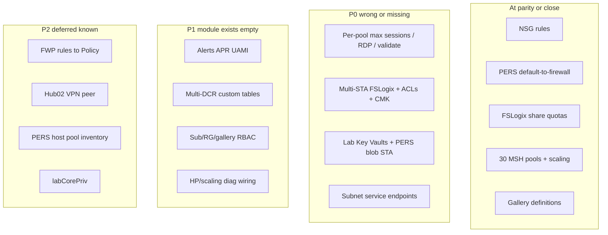

# Gap analysis — legacy Azure 1.0 vs Terraform

**Status:** Documented — remediation waves **under review** (do not implement until approved).  
**Date:** 2026-07-24  
**Scope:** TF-worthy deployables in legacy vs `environments/{int,prd}` + `modules/**`.

**Companion:** [03-cursor-handoff.md](03-cursor-handoff.md) · [02-azure-1.0-to-terraform-migration.md](02-azure-1.0-to-terraform-migration.md)

---

## Scope

**Compared:** legacy `platform` / `pers` / `mult` / `scripts` / `images` deployables vs current Terraform cutover stacks.

**Excluded (by design):**

- Session-host VMs / extensions / placement
- Classic hub/spoke → vWAN topology rewrite (already done)
- Packer image **versions**
- AAD group membership / Desktop Virtualization User on AGs
- FSLogix profile housekeeping / redirection XML apply
- Agent VMSS
- Azure Policy initiatives (full Secure-Hub FW rules workstream)
- Private Endpoints / Private DNS (legacy 1.0 never had them)

**Already at good parity (recent work):**

- PERS/MSH NSG custom rules (legacy-exact, including 01i RPA / 01k–01l thin)
- PERS `default-to-firewall` route table
- MSH 3-rule UDR scaffold
- FSLogix **share names/quotas** (int RTL 100 GB; prd hostpool quotas incl. 005-01 = 51200)
- MSH 30 host pools + per-BU scaling/decom catalog
- Gallery ~50 image definitions
- Hub shells + empty/stub firewall policy

---

## Verdict

Scaffold covers the **shape** of the platform, but several **legacy-exact** settings that Terraform should own are still missing or incorrect — same class of miss as the empty NSGs / wrong single `profiles` 5120 GB share found earlier.



---

## 0. Repo hygiene — `legacy/` on GitHub

**Finding:** [`.gitignore`](../../.gitignore) already has `legacy/`, but the remote can still show nested **gitlinks** (mode `160000`, no `.gitmodules`):

- `legacy/images/vdi-images`
- `legacy/initiatives/vdi-initiatives`
- `legacy/libraries/vdi-libraries`
- `legacy/mult/vdi-mult`
- `legacy/pers/vdi-core-pers`
- `legacy/platform/vdi-platform`
- `legacy/scripts/vdi-scripts`

Ignore rules do not untrack paths already in the index.

**When approved:**

```bash
git rm -r --cached legacy/
# commit + push when asked — keeps local working trees for comparison
```

---

## P0 — Wrong or missing (would ship incorrect/incomplete infra)

### 1. MSH host-pool settings are not legacy-exact

[`environments/int/avd/main.tf`](../../environments/int/avd/main.tf) (and prd) apply **one** `maximum_sessions_allowed = 16` and **no** `custom_rdp_properties` / per-pool `validate_environment` / scheduled agent updates.

Source: `legacy/mult/vdi-mult/params/hostpools/uks-EEE-vdi-avd-hpl-mult-*.json` + `params/RDPProperties.json`.

| Gap | Legacy | TF today |
|---|---|---|
| Max sessions | **6–18 per pool** (e.g. 001-00=6, 001-01=10, 003-01=18) | Blanket **16** |
| RDP profile | Per-pool `MULT-standardV2` / `printcopypasteV2` / `allV2` / `SSO*` | `null` (Azure defaults) |
| `validationEnvironment` | `true` on many `-00` canaries | default / unset |
| `startVMOnConnect` | `false` everywhere sampled | module default `false` (OK) |
| Agent update windows | Scheduled Sat 01:00 GMT | **not in** [`modules/avd/hostpool`](../../modules/avd/hostpool/main.tf) |

**Verified per-pool max / RDP (sample):**

| Pool | max | rdp | validate |
|---|---|---|---|
| 001-00 | 6 | MULT-standardV2 | true |
| 001-01 | 10 | MULT-standardV2 | false |
| 001-02 | 6 | MULT-printcopypasteV2 | false |
| 003-01 | 18 | MULT-standardV2 | false |
| 005-01 | 18 | MULT-standardV2 | false |
| 999-01 | 15 | MULT-SSOstandardV2 | false |

**Fix direction (Wave A):** Extend `local.msh_host_pools` with max sessions, RDP string, validate flag; wire into `module.hostpool`; add `scheduled_agent_updates` if azurerm supports it.

### 2. FSLogix storage shape is still incomplete

Share **quotas/names** were fixed; **account layout** was not.

| Gap | Legacy | TF today |
|---|---|---|
| STA count | **Per-BU** accounts (`p_FSLogixSta`: 01a → 001/002/003/004/008/009; 01b → 005/006/007/999) | **One** STA for all shares |
| SKU / auth | Premium_ZRS + AAD Kerberos domain GUID | Premium FileStorage; AADKERB type only (no domain GUID in labs) |
| Network ACLs | Deny + allow AVDSubnet + AgentsSubnet | **none** |
| CMK | UAMI + KV key per STA | **not set** |
| File diagnostics → LAW | yes | **not set** |
| SMB share RBAC | `fslogix_roles.bicep` | **missing** (NTFS may stay Hybrid/PS) |

### 3. Lab Key Vaults + PERS blob storage — missing from int/prd labs

Legacy `labCorePersistent` / `labCoreMulti`:

- Premium KV per lab, RBAC, VNet ACL (AVDSubnet + AgentsSubnet)
- PERS **blob** STA (`p_sta`) with VNet rules

TF labs today: spokes + one FSLogix STA only. AVD stack has one empty KV shell — **not** the per-lab KVs.

[`modules/core/keyvault`](../../modules/core/keyvault) exists but is **not wired** into `environments/*/labs`.

### 4. Subnet service endpoints not set

Legacy lab subnets expose **Microsoft.Storage** + **Microsoft.KeyVault** for the ACL model.

TF labs never pass `service_endpoints` on PERS/MSH subnets (spoke modules support it).

---

## P1 — Module capability exists; env maps empty / incomplete

| Item | Legacy | TF module | Env status |
|---|---|---|---|
| Action groups + ~17 alert templates + APR + alert UAMI | `platform/.../bicep/alerts` | `modules/platform/management` supports AG + metric/activity/query alerts | **empty** — `TODO(Phase D extend)` |
| Multi-DCR + custom LAW tables (MSH + PERS + Robot RDP) | `mult/.../vdi_dcr.bicep`, scripts `uks-EEE-vdi-avd-dcr-*.bicep` | Only optional single AVD Insights DCR | Incomplete |
| Mgmt / gallery / WVD Power-On-Off subscription RBAC | `access.bicep`, `vdi_sub_roles.bicep`, `gallery_roles.bicep` | role_assignment maps | `mgmt_role_assignments={}`, `gallery_role_assignments={}` |
| Host-pool diagnostic settings | yes | hostpool supports `law_id` | Only if `var.law_id` set; scaling-plan **diag not in module** |
| Hub/FW/VPN diagnostics → LAW | hub Bicep | hub modules support LAW id | connectivity **does not pass** LAW id |
| IP Groups on FWP | large `p_ipGroups` set | firewall-policy module supports | **empty** (full rules → Policy; IP groups may still be needed for smoke) |

---

## P2 — Known deferred / intentionally empty

| Item | Notes |
|---|---|
| Full AZFW rule collections | Deferred to Azure Policy / `vdi-initiatives` |
| Hub02 VPN site/connection | GW only; LLD Open Item 5 |
| MSH `0.0.0.0/0` next-hop type | `PENDING(LLD)` |
| `pers_host_pools = {}` | Scaffold ready; needs live PERS inventory |
| `labCorePriv` (local FW spoke) | Exists in legacy int; **no TF spoke** |
| ASGs for session hosts | Tied to VM deploy → stays PS unless reused |
| NSG flow logs | Legacy params wired; no Bicep resource found |
| Private Endpoints / Private DNS | Not in legacy 1.0 |
| Naming PENDING(TDA) AVD abbrs | `vdh/vdw/...` |

---

## Explicit non-gaps (stays PowerShell — OK)

Session hosts, Packer versions, token consume by pipelines (TF still mints/rotates registration tokens), Desktop Virtualization User on AGs, AAD membership, FSLogix profile delete/redirection XML apply, agent VMSS, ADE/disk/power/decom ops.

---

## Recommended remediation waves

**Do not execute until approved.** Suggested order:

### Wave A — AVD object parity (highest “wrong config” risk)

1. Port per-pool `maxSessionLimit`, `validationEnvironment`, and resolved `custom_rdp_properties` from hostpool JSON + `RDPProperties.json` into `local.msh_host_pools` (int + prd).
2. Add scheduled agent updates to `modules/avd/hostpool` if provider supports; else document as known gap.
3. Wire scaling-plan diagnostic settings if legacy had them.
4. Update [dummies-guide.md](../dummies-guide.md) — remove “max sessions 16” as universal truth.

### Wave B — Labs storage / KV / network ACLs

1. `for_each` FSLogix STAs per BU suffix from `p_FSLogixSta` (01a/01b); put each pool’s shares on the correct STA.
2. Network rules: deny-by-default + AVDSubnet + AgentsSubnet; AgentsSubnet id from mgmt output.
3. Service endpoints on lab subnets.
4. Per-lab Key Vaults (PERS + MULT) via `modules/core/keyvault`.
5. PERS blob STA (module call or thin storage-blob helper).
6. CMK: lab KV key + UAMI + STA CMK (mirror legacy `sa_kvkey` / `kv_roleassignment`).

### Wave C — Monitoring / RBAC fill (backlog)

1. Port alert templates + action groups + APR + UAMI into mgmt (or dedicated alerts stack).
2. Port MSH/PERS DCR set + custom tables (beyond single Insights DCR).
3. Fill `mgmt_role_assignments` / gallery Packer MSI / WVD Power-On-Off Contributor from legacy access params.
4. Pass LAW id into connectivity hub diagnostics.

### Wave D — Inventory-driven (backlog)

1. Fill `pers_host_pools` from live/legacy PERS catalog.
2. Decide labCorePriv (in/out of cutover).
3. Clean obsolete `environments/prod` when unlocked.
4. Untrack `legacy/` gitlinks from GitHub (section 0).

---

## Quick reference — env stack map

```text
_global          → vWAN
connectivity     → FWP stub, Hub01, Hub02 (VPN peer missing)
mgmt             → LAW + DCE + Insights DCR; alerts empty; agent VMSS stays PS
labs             → PERS/MSH spokes + NSG/RT; FSLogix shares OK; STA/KV/ACLs incomplete
avd              → 30 MSH HP + scaling; RDP/max sessions wrong; PERS map empty; gallery defs OK
```
