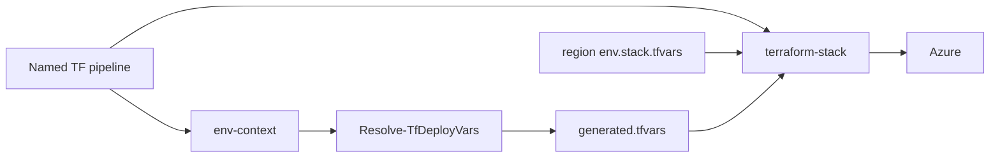

# 06 — Resolve deploy vars (pre-req, drop example seeding)

**Status:** Planned  
**Owner:** platform TF / AzDo  
**Depends on:** named pipelines + `environments/region/<location>/<env>.<stack>.tfvars` (connectivity slice done)  
**Pilot:** IGMF uksouth connectivity via [`tf-Hub-Deployment.yml`](../../pipelines/tf-Hub-Deployment.yml)

## Problem

Today, when a region var-file is missing, IGMF uksouth **seeds** `*.tfvars.example` → `terraform.tfvars` in the stack workdir. That is a sandbox shortcut.

Legacy pipelines usually:

1. Authenticate (service connection)
2. Run a **pre-req** (config / GLB / “get subs info” style helper)
3. Populate deploy variables
4. Deploy

We want TF named pipelines to resolve **runtime IDs** the same way, instead of copying examples.

## Goal

- Keep **design values in git** (`environments/region/...` — CIDRs, tags, DNS, flags).
- Resolve **runtime values at pipeline time** (subscription GUID, `virtual_wan_id`, later hub/LAW IDs).
- Remove reliance on `seedIgmfTfvars` / example copy for stacks that have a resolver.

## Non-goals (this plan)

- Rewriting GLB libraries
- Auto-discovering hub CIDRs (those stay in region tfvars)
- Replacing `env-context.yml` SC/agent mapping
- int/prd live apply (still need real GUIDs — resolver helps once VGs/Azure exist)

## Target flow

```text
Named pipeline (e.g. tf-Hub-Deployment)
  → env-context.yml          # SC, agent, backend VG
  → Resolve-TfDeployVars.*   # NEW pre-req
  → terraform-stack.yml
       -var-file=region/<loc>/<env>.<stack>.tfvars   # committed baseline
       -var-file=$(Agent.TempDirectory)/generated.tfvars  # from resolver
       -var=location=<loc>
       (+ hub enable flags for connectivity)
```



## What lives where

| Keep in region tfvars (git) | Resolve at pipeline time |
|---|---|
| Hub / spoke CIDRs | `azure_subscription_id` (from SC context, VG, or Graph) |
| DNS, feature flags | `virtual_wan_id` (lookup after vWAN apply) |
| `mandatory_tags`, `environment`, `subscription_code` | Later stacks: `hub01_id`, `hub01_firewall_private_ip`, `hub02_id`, `law_id`, `agents_subnet_id` |
| `location` (also overridden by `-var`) | Tenant / backend already via env-context |

## Implementation sketch

### 1. Script

Add e.g. [`scripts/Resolve-TfDeployVars.ps1`](../../scripts/Resolve-TfDeployVars.ps1) (PowerShell to match legacy ops style):

**Inputs:** `-EnvName`, `-Location`, `-StackName`, `-OutFile`

**Behaviour (pilot — connectivity):**

1. Assume Azure CLI already logged in as the pipeline SC (or accept ARM_*).
2. Set `azure_subscription_id` from `az account show --query id` (or named VG override).
3. Resolve `virtual_wan_id`:
   - Prefer Azure lookup by known name/tag from naming module conventions, **or**
   - Read from last vWAN apply output / state blob if lookup is fragile on day one.
4. Write HCL or `.tfvars` to `-OutFile` with **only** resolved keys (do not duplicate CIDRs).

**Later stacks:** extend switch on `-StackName` (`mgmt`, `labs`, `avd`) to look up hub/LAW outputs from Azure or prior state.

### 2. Pipeline wiring

In [`pipelines/templates/terraform-stack.yml`](../../pipelines/templates/terraform-stack.yml):

- New optional parameter `resolveDeployVars` (default `false`; enable from Hub / named pipelines for IGMF pilot).
- Step **before** plan/destroy (after ARM creds export): run resolver → `$(Agent.TempDirectory)/tf-resolved.tfvars`.
- Append second `-var-file` when file non-empty (resolved **after** region file so IDs win).
- When resolver succeeds for a stack, **skip** `seedIgmfTfvars` for that run (region file + generated cover values).

### 3. Region tfvars cleanup (after pilot works)

- Remove hardcoded `virtual_wan_id` / subscription GUID from IGMF uksouth connectivity tfvars (or leave commented as local-dev fallback).
- Keep CIDRs + tags in git.

### 4. Docs

- Update root README “How a release run works” + [`pipelines/README.md`](../../pipelines/README.md).
- Note legacy parallel: config.yml / VG ≈ region tfvars + resolver; not `tfvars.example` seed.

## Phased delivery

| Phase | Done when |
|---|---|
| **P0** | Script stub + unit-friendly dry-run (writes placeholder file without Azure) |
| **P1** | IGMF uksouth connectivity: resolve sub + `virtual_wan_id`; Hub pipeline uses dual `-var-file`; seed skipped when resolved |
| **P2** | Same for `tf-vWAN-Deployment` consumer path documented; connectivity tfvars no longer hardcode vWAN id |
| **P3** | mgmt/labs: resolve hub/LAW IDs into generated tfvars (replaces hand-paste between stacks) |
| **P4** | int/prd once VG / SC provide real subscription context |

## Risks / decisions

| Topic | Note |
|---|---|
| Lookup vs state | Prefer Azure resource query by TDA name when stable; fallback to state/output download if needed |
| Secrets | Do not write secrets into generated tfvars; SP stays in SC / ARM_* |
| Italy/Spain | Resolver does not invent CIDRs — still blocked until region tfvars filled + real SC/backend |
| Windows vs bash agents | Named bank agents are Windows-friendly for PS; IGMF hosted may need `pwsh` or a bash port |

## Out of scope references

- Current seed logic: `seedIgmfTfvars` in `terraform-stack.yml`
- Region packages: [`environments/region/README.md`](../../environments/region/README.md)
- Subscription inventory (manual TODOs): [`docs/subscription-inventory.md`](../subscription-inventory.md)

## Acceptance (P1)

1. Queue `tf-Hub-Deployment` with `envName=igmf`, `location=uksouth`, `action=plan`.
2. Scope banner shows region var-file **and** resolved var-file.
3. Plan receives subscription + `virtual_wan_id` without copying `terraform.tfvars.example`.
4. No commit of generated tfvars (temp dir / gitignored only).
